# Moroccan Darija (Arabic) GPT

**A 13.8M-parameter transformer that writes Moroccan Darija, built from scratch in PyTorch.**

No pretrained weights, no fine-tuning, no `transformers` import. Attention, the blocks, the training loop, the sampler: all of it written line by line. 282 million tokens of Darija, 78 minutes on one GPU, about 45 cents if you had to rent it.

<picture>
  <source media="(prefers-color-scheme: dark)" srcset="docs/samples-dark.svg">
  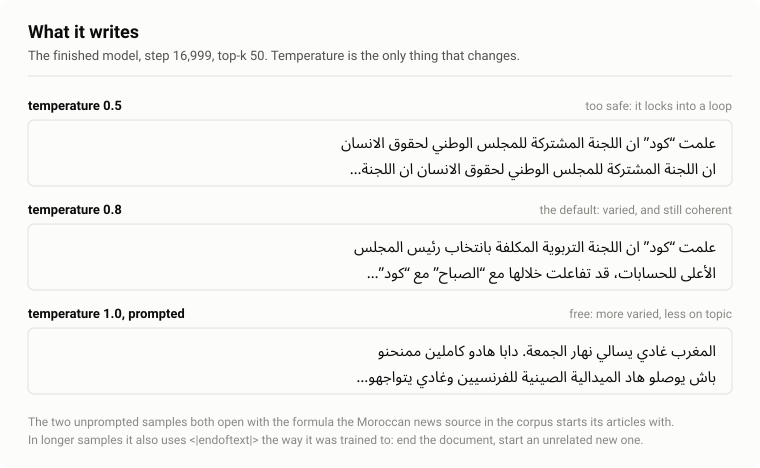
</picture>

Real output from `src/sample.py`, run against the finished checkpoint. The only thing that changes between the three is the sampling temperature.

## The numbers

| | |
|---|---|
| Parameters | **13,810,944** (6 layers, 6 heads, 384 dims, 256-token context) |
| Tokenizer | 8,000-token byte-level BPE, trained on the same corpus |
| Training data | 281.9M tokens from 927,950 Moroccan Darija documents |
| Hardware | one Tesla T4, 16 GB |
| Training time | **78 minutes**, 17,000 steps, one pass over the corpus |
| Final loss | train 3.80, **validation 3.93**, perplexity 51 |
| Tests | 5, including one that fails if attention ever leaks the future |

For scale: a model that knows nothing scores 8.99 (perplexity 8,000). A model that knows only how often each token appears scores 7.71 (perplexity 2,227). This one scores 3.93, which is 44× better than the second, out of 8,000 possible tokens it has narrowed the next one down to about 51.

## What it is, and what it is not

**It is** a small language model that writes fluent, idiomatic Darija in the registers it read: news copy, instruction-style question-and-answer, forum storytelling. It learned document structure well enough to reproduce those templates, and it learned `<|endoftext|>` well enough to close one document and start an unrelated one.

**It is not** a model that knows anything. Ask it about JavaScript and it produces a perfectly formatted tutorial that says nothing at all:

<blockquote dir="rtl">
<p>واش ممكن تعطيني الكود ديال JavaScript باش نقدر نبنيو وظيفة ديال الكود ديال JavaScript؟</p>
<p>أكيد، نقدر نعاونك تصاوب وظيفة ديال الكود ديال JavaScript... حدد الكونفيگوراسيون ديال JavaScript: هاد الكونفيگوراسيون ديال JavaScript غادي تكون فيها سيرفر ديال JavaScript</p>
</blockquote>

*"Can you give me the JavaScript code so I can build a JavaScript code function?, Sure, I can help you build a JavaScript code function. Define the JavaScript configuration: this JavaScript configuration will contain a JavaScript server..."*

Correct register, correct grammar, correct shape of a helpful answer, zero content. At 13.8M parameters, with every token seen exactly once, that is the honest ceiling, and knowing where the ceiling is was part of the point.

## The data

One source, one script, one tokenizer: [`atlasia/Atlaset`](https://huggingface.co/datasets/atlasia/Atlaset), the largest open Moroccan Darija corpus, read directly from its Parquet shards.

<picture>
  <source media="(prefers-color-scheme: dark)" srcset="docs/corpus-dark.svg">
  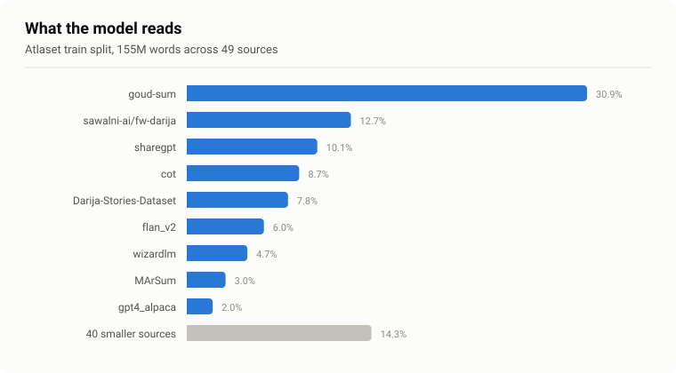
</picture>

1,171,515 documents in, 927,950 kept. The 20.8% dropped were almost all shorter than 32 characters. Exact duplicates: **zero**, which was worth the 13 minutes it took to check rather than assume.

Measuring the corpus turned out to be the first real lesson. Streaming the first few thousand rows and extrapolating gave an answer that was wrong by 9×, because a stream of a sharded dataset is a prefix, not a sample, and the first shard is full of unusually short documents. The fix was to read the Parquet footers and one light column instead: exact counts, no download.

The tokenizer is a byte-level BPE, so there is no unknown token, every byte has an id, and Arabic script costs two bytes per character before the merges start.

<picture>
  <source media="(prefers-color-scheme: dark)" srcset="docs/tokens-dark.svg">
  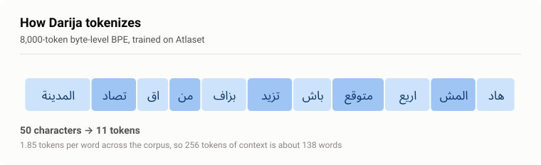
</picture>

The result: 3.12 characters per token, 1.85 tokens per word.

## How it works

The architecture is clear and small and the point of this project was to understand every line, not to invent a new one.

A token id becomes a vector, a position vector is added to it, and the result flows through six identical blocks into a final projection back to 8,000 logits.

<picture>
  <source media="(prefers-color-scheme: dark)" srcset="docs/model-dark.svg">
  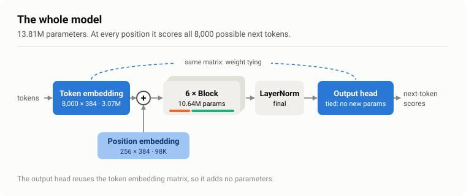
</picture>

The output head and the token embedding are **the same matrix**, used in both directions. That is weight tying, and it saves 3,072,000 parameters, 22% of the model, on the theory that if two tokens are similar going in, they should be similar coming out.

### Attention, in one picture

Every token looks at every token before it, and at itself, and at nothing after. Drawn right to left, the way the language is written:

<picture>
  <source media="(prefers-color-scheme: dark)" srcset="docs/attention-dark.svg">
  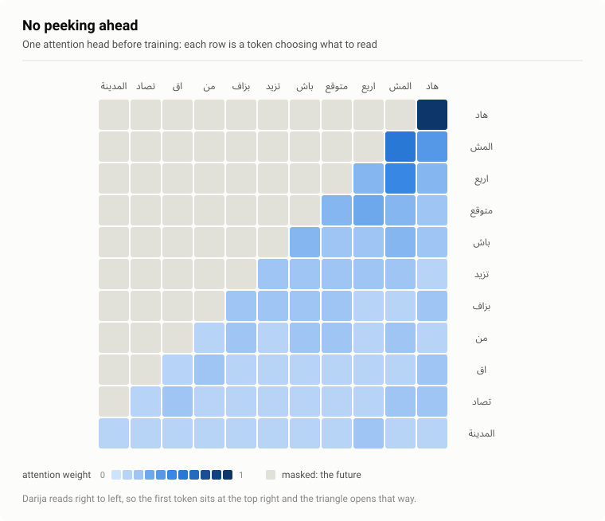
</picture>

The triangle is the causal mask: scores for future positions are set to −∞ before the softmax, so they come out as exactly zero probability. This is enforced by a test, `tests/test_model.py` changes a token and asserts that every output before it moves by exactly 0.0.

### One block

<picture>
  <source media="(prefers-color-scheme: dark)" srcset="docs/block-dark.svg">
  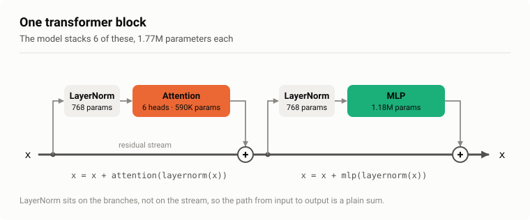
</picture>

Attention moves information *between* positions; the MLP thinks about each position on its own. Both are wrapped in residual connections, and both normalise *before* the layer rather than after (pre-norm), which is what lets six blocks train without warmup tricks.

Where the parameters actually live:

<picture>
  <source media="(prefers-color-scheme: dark)" srcset="docs/params-dark.svg">
  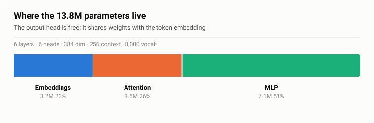
</picture>

## Training it

AdamW, batch 64, 256-token context, 16,384 tokens per step. The learning rate warms up for 100 steps and then follows a cosine down to a tenth of its peak:

<picture>
  <source media="(prefers-color-scheme: dark)" srcset="docs/lr-dark.svg">
  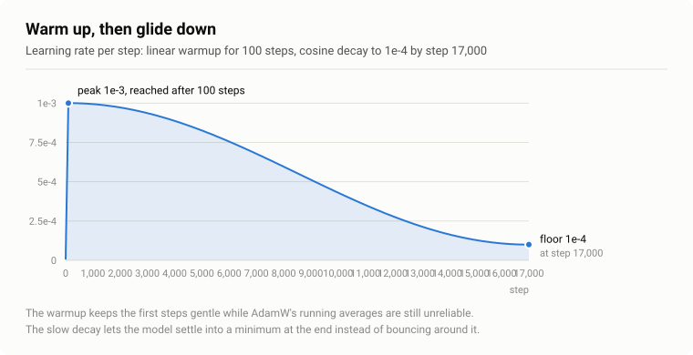
</picture>

The schedule is a pure function of the step number, which means a run that dies and resumes lands on exactly the right learning rate, no extra state to save, nothing to get wrong.

The GPU is a T4, which has fp16 tensor cores and no bf16, so training runs in mixed precision with a gradient scaler: the loss is scaled up before the backward pass so small gradients do not vanish into fp16's floor, then unscaled before clipping so the clip sees real numbers.

<picture>
  <source media="(prefers-color-scheme: dark)" srcset="docs/amp-dark.svg">
  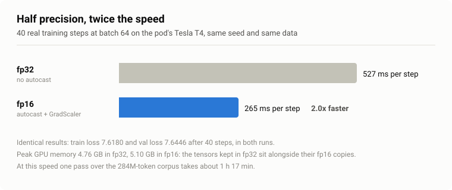
</picture>

Twice as fast, identical losses. That one change is the difference between a 2.5-hour run and a 78-minute one.

Checkpoints go to S3 (165.9 MB each: the weights are only a third of it, AdamW's two running averages per parameter are the rest), because the GPU pod is ephemeral and a run that cannot resume is a run you get to do twice.

And then it trains:

<picture>
  <source media="(prefers-color-scheme: dark)" srcset="docs/train-dark.svg">
  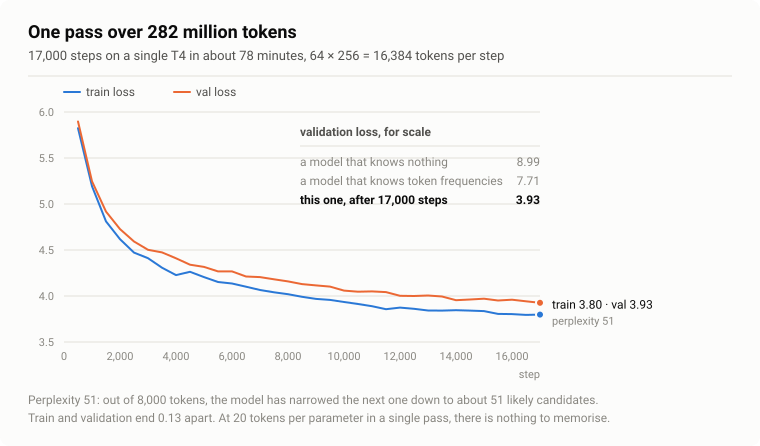
</picture>

Train and validation end 0.13 apart, and the best validation loss in the whole run is the last one. With 20 tokens per parameter and every token seen once, there was nothing to memorise, which is also why dropout is set to 0.

## How I know it works

Three checks before training:

<picture>
  <source media="(prefers-color-scheme: dark)" srcset="docs/checks-dark.svg">
  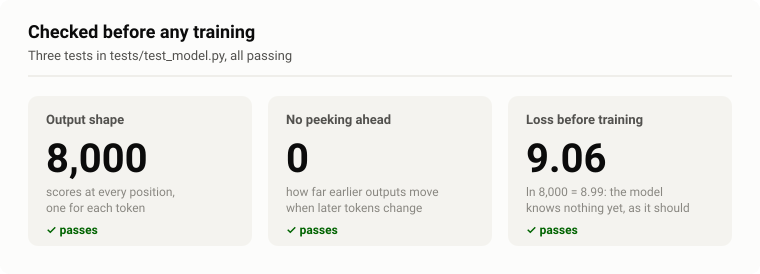
</picture>

The third one is the useful one. An untrained model should put 1/8,000 on every token, giving a loss of ln(8,000) = 8.99. Measured: 9.07. If it had come out at 300, the initialisation was broken; if it had come out at 3, information was leaking from the targets.

Then the check that the optimisation actually optimises, train the real model on one single batch, over and over, and watch it memorise:

<picture>
  <source media="(prefers-color-scheme: dark)" srcset="docs/overfit-dark.svg">
  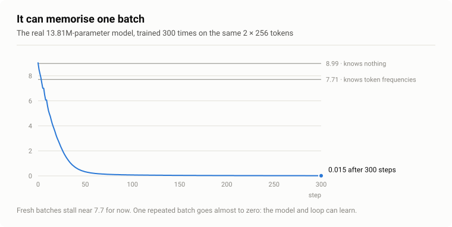
</picture>

9.03 to 0.015 in 300 steps. If a model cannot overfit one batch, nothing else it does is meaningful.

## Run it yourself

```bash
pip install torch numpy tokenizers pyarrow huggingface_hub fsspec s3fs pytest
hf auth login          # Atlaset is a gated dataset
```

```bash
python -m src.tokenizer          # train the 8k BPE             (~2 min)
python -m data.prepare           # Atlaset -> train.bin/val.bin (~13 min)
python -m src.train              # 17,000 steps                 (~78 min on a T4)
python -m src.sample --checkpoint ckpt.pt --prompt "المغرب"
```

`checkpoint_path` in `src/config.py` is empty by default, so training saves nothing until you set it, a local path or an `s3://` URL, same code either way. That default is deliberate: no test and no half-finished experiment can overwrite a real checkpoint by accident.

`python -m pytest -q` runs the five tests. Every number in the project lives in `src/config.py` and nowhere else.

## What I would do next

- **A bigger model before more steps.** At 20 tokens per parameter this is already near the compute-optimal point; another pass over the same data buys far less than another few million parameters would.
- **A longer context.** 256 tokens is one or two paragraphs, which is why the model loses the thread. Attention costs O(T²), so this is the expensive one.
- **Ablations to justify the architecture**: weight tying on and off, rotary positions against learned ones, context length, each one a short run against a measured noise floor, so the differences mean something.

## The repo

```
src/config.py      every number in the project, in one file
src/tokenizer.py   trains the byte-level BPE; reads Atlaset from its Parquet shards
data/prepare.py    Atlaset -> deduplicated, filtered, uint16 token arrays
src/model.py       Head, MultiHeadAttention, FeedForward, Block, GPT, generate
src/train.py       batches, mixed precision, clipping, cosine schedule, S3 checkpoints
src/sample.py      load a checkpoint and write Darija
tests/             five tests: shapes, causality, untrained loss, overfitting, schedule
docs/figures.py    every figure above, generated from the code itself
```
